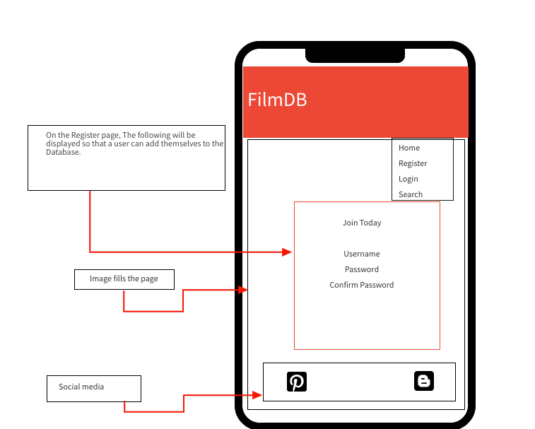
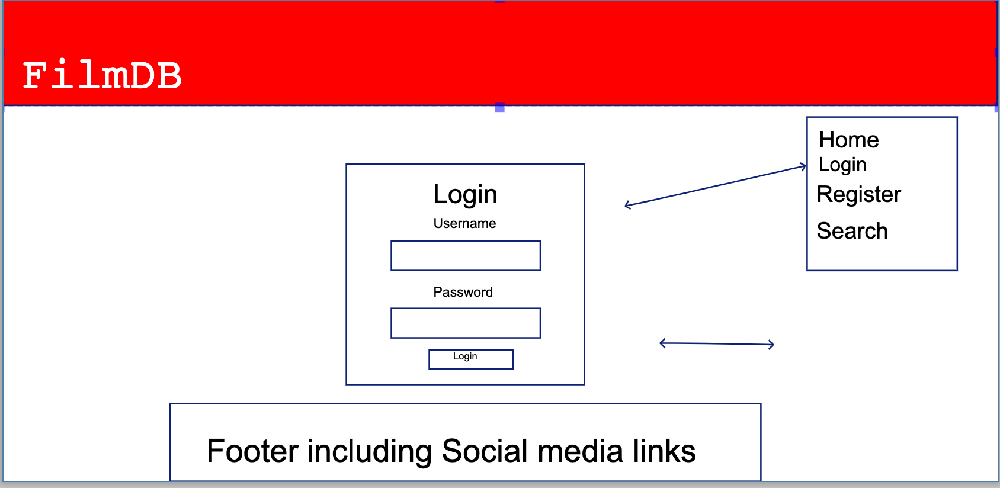
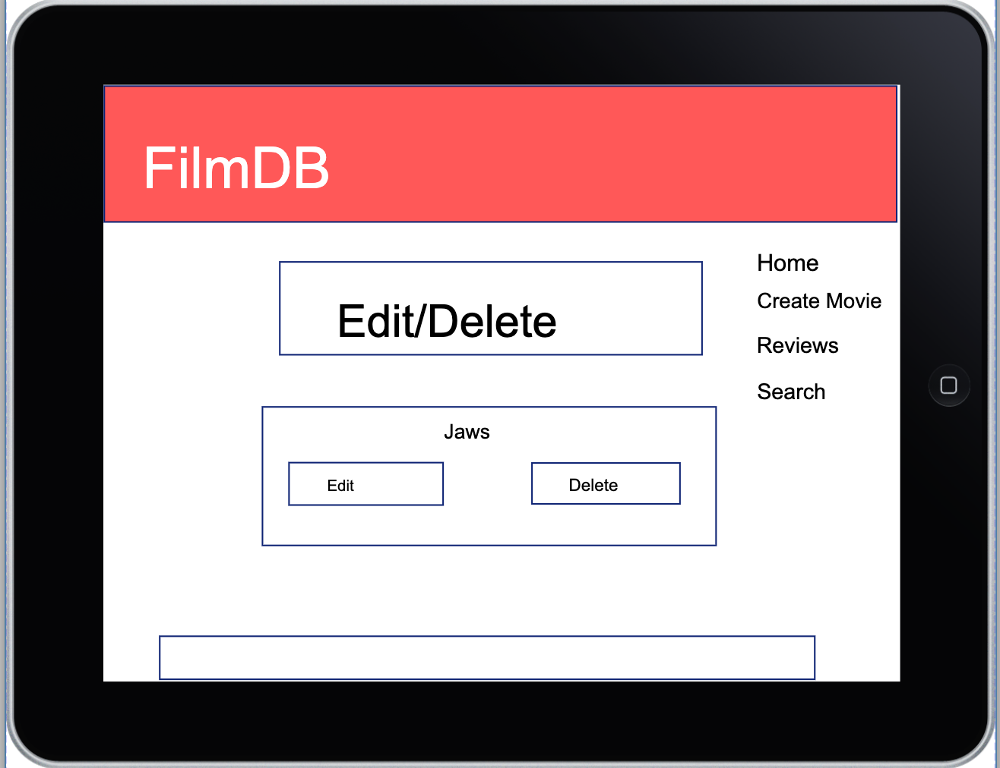
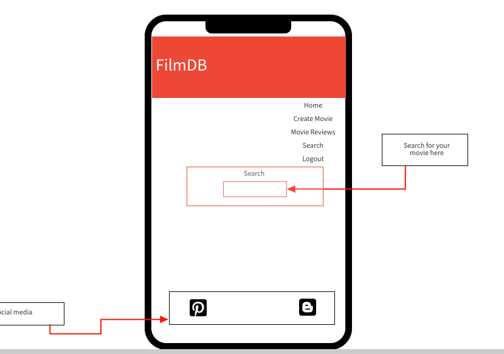

 

[FilmDB](https://film-db.herokuapp.com/) - My Milestone 3 Project

FilmDB is a online database application which is related to all things cinema. A website built wit a search functionailty that allows a user to find a movie and then share their review on that movie. A user's critical review can be used to influence anyone that has an interest in film and FilmDB is the starting point to building that interest. This is the start of something that will grow and in time, it will become the movie search engine with the help of the users for the users.

## Contents

### 1. UX

* [Project Design](#Project-Design)
* [User Objects](#User-Objects)
* [Developers Objects](#Developers-Objects)
* [User Stories](#User-Stories)
* [Wireframes](#Original-wireframe-concepts)
* [Deployment](#Deployment)
* [Testing](#Testing-and-Bugs)

### 2. Features

* [Site Features](#Site-Features)
* [Future Plans](#Future-plans)

### 3. Technologies Used 

* [Technologies Used](#Technologies-Used)

### Project Functionailty of FilmDB. 

* The FilmDB application is a website built with HTML, CSS and most importantly, Flask within Python. It uses the CRUD (Create, Read, Update and Delete) functionality and has a backend handling database using MongoDB. As required, I used Bootstrap for the general layout of the page but I worked outside the norm to include a floating menu rather than sitting at the top in the navigation bar.

* I've included a few extras in the project such as both Registration and Login features adding security to the website and in turn the database. Once logged in, the database offers a view of all user reviews which are shared between secure users.

* Also as required, all code is deployed to the hosting platform Heroku and controlled through Git and Github. To enhance security and stop others from viewing the secret key, I've created a git an ignore file which holds environment variables information such as the secret key as is standard by todays requirements.

### UX (User Experience)

### User Stories

* As a user:

1. I expect the website to look good and it to be a pleasure to use. I expect it to be well designed and the functionailty of the site to work well.

2. I expect to be able to register or login with ease and create or update reviews. I also expect to have the ability to change reviews if required.

3. I expect the search function to look for a movie I may be interested in. Once done, I can then search the database and find reviews on that film. If I find one, great but if not, I can then watch the film and create a review that will provide information to someone else.

4. I don't want it to be confusing to use which might put me off from using the site.

5. I expect searching for a movie to be a simple experience and I can find more information from a review or follow a link to the imdb site for more info if needed.

 * For me as a developer:

 * I've enjoyed working with Python and Flask as I prefer it to JavaScript and the capabilities it provides. I'd like to use the programming language to create more applications and websites.

 * I'd like to see the website/ application to grow as fans create reviews and build the database. 
 
 * I'd like users to become moderators to help build the site to something more.

 * I'd like it to become profitable if it were a real site. To do this, trailers would have advertisements to create revenue.

### User and Project Goals

I would also like users:

  * To share what they think of what they see in todays visual entertainment market. A fan can watch any type of movie they want excluding adult material films and upload information about it. 
  
  * If it's a multi million pound oscar winner that's designed to showcase the talents of a new or existing director, a multi million pound flop with an incredible cast list all the way down to a free handheld open new movie by an unknown director starting their career. They've put their heart and soul into the film and shared it on YouTube, the users at FilmDB can watch it, review and share the film for others to see. 
  
  * I want this to be an easy to use quick experience that will grow as time goes. It's for everyone and it stems from the most passionate of the small and large screen art form. The website is an open source application and technically built by the users to create word and mouth of everything they see.

* All over the world will be able to access the site and so the choices can come from anywhere. UK, America, Foreign Films from Germany, Norway or the Middle East. Anyone can use the site to put their opinion down.

* Variety of what they watch to change so they're not stuck with the same old category all the time. Their viewing opinions can be broadened if they've never thought about a type of film but a good review will spark the users interest. A new foreign film set in Sweden about drugs or an American art house piece about a lonely city in Texas. Who knows what the user will discover.

* To find FilmDB a great place to start their journey into something new. Help bring new directors to peoples screens to help bring new stories to life and not just endless remakes or constant sequels. Fast and Furious anyone!!

### User Objects

* The website has been designed for film fans that want to learn, share and inform others about film. It's an open source design where users can tell anyone and everyone about a film they've seen.

* Aimed at movie enthusiasts who want to spread knowledge of cinema and film
* Finding that film information from sone that love or loath a movie.
* Easy to use.
* A clean site with clear easy to use information.
* Bright and engaging for the user.
* Striking with identifiable comments.
* Searching for a film through the search option and finding the review.

### Developers Objects

* Nicely designed and content friendly with a well thought out user experience.
* The layout is formatted in a way that the user can navigate around the site without frustration.
* A professionally mutli paged site which includes Python, HTML and CSS.

### Future plans

* Offer a larger search functionality
* Add a movie trailer option

## Project Design

* I like to design my web sites with a bold image as the main focal point and as a key feature. The image makes an impact when the user first lands on a page. An instantly recognisable image sets the design and tone of the entire website. 

* I chose a floating menu instead of a Nav bar because it stands out on the page. It's been hard to get the layout working with the menu but I believe it was a great feature to add.

* As you can see in the wireframes and concept section further down, I kept pretty close to my original design. I tried various colour schemes for the heading title but I wanted something that worked well with the background image, the red and black gradient colour looked great with both the image and the color of the borders with the black sci-fi background. The white coloured font stood better in the header comapred to black or grey which lost impact when I made the title bar opaque.

I looked at other sites that had a similar theme to mine and I felt mine was different enough to stand out and be something completely new and fresh and to look cool to a user.

I had to think how to showcase the site to a user and tried to make it engaging from the moment the user clicks on the first page.

### Logo

### Colours

* For the most part, the images used create the colour scheme themsleves. A bold image was chosen to add a poster effect, like a movie poster. Then, I chose a colour scheme that would sit well on top of the images and so a white font used for all the wording. 

* Red Colour Palette

  

* Image created colour palette

  

### Images

* The image chosen was used because it's an instantly recognisable character from the world of cinema from the past 40 years. The target audience will range in variation and so I had to think of something that was striking, not a frightening image for smaller children but cool enough to bring people to the site. The image I chose I believe represented this idea very well and the image stood out in the overall design of the site. 

### Font Used

* [Monserrat found at Google Fonts](https://fonts.google.com/)

[My page](https://film-db.herokuapp.com/)

* A website built for Film lovers that can share their passion!!

* The project I’ve designed is for my third milestone project for the Data Centric Development module of the Full Stack Developer Course. I’ve used Flask and Python to design the majority of layout of the website. This is to provide functionality and sits within the HTML shell with added elements of CSS to add styling. 

  This is a Multi Page Applciation website. Users are able to login to a Mongo Database which works in conjunction with Heroku and WTForms.There's an API in the background that allows the user to search for Films and even TV from screen entertainment. As mentioned, there's a contact page which as well.

### Original wireframe concepts

* The wireframes were originally drawn out by hand and then I created the final concept design below the wireframes. A bold header and striking image was how I visualised it and the final product stayed pretty true to concept design.

* Wireframes show each page on a differnet format including a Full Screen web page, a Tablet and a Mobile layout. Due to my free versions of Balsamiq coming to an end and one type. I used Mocha for the mobile and I apologise but I used pencil for the others which wasn't as nice

Home page

 

* The home or index page contained two different menus, a before and after logged in menu. You'll see this in other images below but the top image on a mobile device indictates the difference in menus. A main hero image is used as the main background and the character is from a very well known movie franchise. The character being a forefront in cinema indicates this is a movie entertainment built website. The home page also has a brief informatio piece of what the website is about.

  

  

  

  

Registration page

 

* The registration page is simple in design but the fundamentals and technology behind it is fairly compicated. It pushes the users data to the MongoDB through Python Flask routes. The front end registers the user and once done, a message indicating they're logged in as the user when clicking submit. If they have an account and they click registration. The design keeps the aesthetics of the original home page layout. If a user is already registered, a link to the login page will be added.

  

  

  

Login page

 

* The login page has been designed the same as the registration page but with less showing on page. Registration becomes Login and only one password field This again, when clicking on login will show a flash message saying "You are logged in as (username)". If the user isn't registered, a link to the Registration page will be added.

  

  

  

Logged in page

 

* The logged in page as explained above is displayed once registered or logged in showing successful connection to the site and to the database.

  

  

  

Create Reviews page

 

* To do anything based around a review, you will need to be logged in as this navigation menu will be locked out to none users. Once logged in, the Create Movie reviews option is displayed. Here, you will simply type in the name of the movie and then enter your review.

  

  

  

Movie Reviews page

 

This is where a logged in user can see all reviews from the database. More than one review can be added for a film with the same name so you could have 5 reviews for "King Kong2 for instance. You also have the ability to change a review by cliking on the name of the movie.

  

  

Edit and Delete page

 

Once you've clicked on the name of the movie, the Edit or Delete options are displayed. These are self explanatory and this is where the user is able to make a change or remove a review.

  

  

  

Search page

 

* The search page is available to both logged in and logged out users. Simply type in the name of a movie you're searching for and it'll bring up a poster image of the movie and a link to the movie on imdb. The search is automatic, you type and it'll automatically display the movie.

  

  

Search Movies page

 

* As indicated, the search option will show the movie poster (image) and a link will also show to the imdb page.

  

  

  

Deleted Page

 

* A logged in user has the option to delete the movie and once done, a flashed message pops up saying the info has been deleted, I'll use a movie reference in the finished site as well.

  

## Early draft concept design

* This was an original concept design I thought of when I first started to the project. I think the finalised website kept the similarities to the original layout.

  

### Technologies Used

#### Languages IDE and Deployment Control

* HTML
* CSS 
* Python
* Javascript

### Frameworks and Libraries

* Flask
* [Bootstrap](https://getbootstrap.com/docs/4.3/getting-started/introduction/
* [Google Fonts](https://fonts.google.com/) 
* [Favicons](https://www.favicon.cc/)
* [Github](https://www.github.com)
* [Heroku](https://www.heroku.com)

#### Tools Used

* [MongoDB](https://www.mongodb.com/cloud/atlas)
* [Balsamiq](https://balsamiq.cloud/#login)
* [pencil](https://pencil.evolus.vn/)
* [W3C HTML Validator](https://validator.w3.org/)
* [W3C-CSS-Validator](https://jigsaw.w3.org/css-validator/)
* [PEP-Python-Checker](http://pep8online.com/)
* [OMDB API](http://www.omdbapi.com/) 
* [Cukmekerb-coding-class-for-the-help-here] (https://www.youtube.com/watch?v=67eJTr6_ylY)
*  [Autoprefixer](https://autoprefixer.github.io/)

## Site Features

* CRUD - Create, Read, Update and Delete

Create - A user can login to the site and create a movie review.
Read - A user can read a published review.
Update - A user is able to update one of the published reviews.
Delete - A user is able to delete a published review.

### Registration and Login Design added for security and defensive design purposes to protect data from the database.

I added security to my application and built templates and the functionailty into the app.py file. This included the following:

A registration technique that posted a user's accepted details to the MongoDB collection in the database.

Once registered, I created the Login part of the process which allowed a user to login respectively and they were then able to work with the CRUD system and Create an entry, Read an entry, Update an entry or Delete an entry to build the Database.

The security built acted in the following process:

1. Register, if already registered, a "Go to the Login page" function was added.
2. If passwords don't match when registering, a "Passwords do not match" message pops up.
3. If a user is already registered with that name a "That username is already registered, please choose another" message is displayed.
4. Login, if not registered, "Go to the registration page" function was added.
5. If password is incorrect, a "Password is incorrect message is displayed"
6. Logged in twice, a flash message "You crazy kid, you're already logged in" was displayed.
7. Once logged in or registered, a green outlined box is shown showing "A successful login" and you'll also have that displayed on the home page when the user is logged in.
8. The logged in name is also displayed when a delete is made.

### Media and Content

* The images were searched and found on Google

* All content was written by myself.

### Code

* I've used various code for this website all written fresh. I did get an understanding for part of the code by deciphering some of Anthony O'Brien's and Paul Bennet's code. It was generic code, nothing direct from their content but I had an issue with the hashed encryption and I had it the wrong way around. I was also using encode instead of decode. I spoke with tutors but the one's I spoke with had used the Werkzeug security system and so I was advised to speak to others who had used bcrypt. Anthony and Paul had done so they showed me their code so I could put mine in the correct order to allow the login to work. Registering was fne but Login was causing me issues.

* HTML - All code produced by Matthew Lister except for the content such as the main background image. This was searched and found on Google Chrome and
then added into img source code which I had put together. I used script tags from Google Fonts to display the correct formatted fonts.

* Python and Flask - All code produced by Matthew Lister with some support from CI tutors and the review of Anthony and Paul's code to assist resolving an issue i had.

* CSS - All CSS code was produced by Matthew Lister originally typed to add styling to the HTML page. This included Font styling, image sizing and
colour choices

### Issues and setbacks whilst building the site and time taken (that should be my nickname)

* THe site works fine across all browsers which is great but on small mobile devices, the navbar caused me issues. it worked fine when logged in on most devices but either the Header title or the Navbar would not sit right at the top of the page. Changes to both caused major display issues on other devices so it was a headache trying to resolve the issue.

* The search function displays the film as you automatically type so you don't have to press Enter. I tried to chanbge this so you had to press Enter but it kept giving me Method Not Allowed. But, searching and the movie displaying the poster which is what it's meant to do worked 100%.

* I struggled with some of the CRUD stuff and multiple pages but help from tutors got me through the process. I spent a lot of time researching things myself and got far but the last parts I struggled with. It needed a 2nd persons eyes to spot those small mistakes and advise on the changes. I really need to contact a tutor sooner rather than later.

### Testing and Bugs

* I tested the website on multiple browser platforms including Mozilla Firefox, Google Chrome and Safari. I used Google Chrome and Mozilla Firefox at different points whilst designing the site due to some caching issues in Chrome at times. 

* As always with my projects, they take me a while to do as I've struggled with the course. Workkng on this site has been good though and I've learnt a lot. Testing was done by my family to see if they could navigate around the site and this worked well, especially when my daughters saw there names displayed on screen so they got a personal feeling which is nice.

* I also asked for the site to be tested through Slack in Peer Review which gave me some great feedback, a few things to work through:

Feedback Page

 

Morning @Matthew , couple of small things in your code I noticed via your Repo:
In your css file, the very last css declaration on line 236 for the .task-header is missing it's closing } curly brace, found this in your repo. It might be a good idea to pass the css file into a validator aswell as some of your indentation is a bit un-uniform throughout the file.
Your get answer function in your js file could use a comment or explanatory jsdoc comment to explain what it does?
I'm not sure if it was intentional, but you have inline JS script in your films.html template? But it looks identical to what you have in your js file, so it might be worth removing this?
On github, some of your html layout is a bit skewed? I'm not sure if this is because of GitPod, but I remember recently someone got scored down on this even though it was beautified via GitPod. Might be worth a little check into this via your Github to see what I mean, for example: createmovie.html template.
In your index.html template, you have a huge paragraph in your h5 element. Conventionally speaking, it might be considered better use of code to split this content into a definable heading element and then a supporting paragraph element.
In your base.html file you have two jQuery script links?
In your app.py, you have some commented out print statement on lines 110-112, it might be worth removing those before submission as commented out code is considered bad practice.
It might also be worth checking out Python docstrings to add some complementary commentry to your functions for the assessor. https://www.python.org/dev/peps/pep-0257/

Website feedback:
Your linked-in social link didn't direct me anywhere? It kept returning me back to the home page and updating the link to this: https://film-db.herokuapp.com/www.linkedin.com/in/www.linkedin.com/in/www.linkedin.com/in/matthew-lister1979 .....very strange.
The search bar worked great, I typed in Alien, and it was returned instantly so well done on that. However, as I wanted to see how a generic user might act, I added alien and then clicked enter.....it redirected me to a Method Not Allowed page? Gyazo gif attached below.
Registration & Login worked great!
Not sure if this is intentional, but I was able to update a record already added to the Movie Reviews section. I updated Crocodile Dundee to Croc-Attack ? Is this intentional? If so, maybe add some context text to this page to tell the user that this is a Publicly-Updated DB much like how wikipedia works etc.
I was able to create a movie review but on submitted I expected to be redirected to the Movie Reviews page to see my record add dynamically to the list of reviews?
Deleting the review was fine, however, it is a one-click delete, to a user that might be detrimental to User Experience if they clicked delete by accident, for example, if they meant to click on edit, but instead hit delete.
Logout worked great!

Responsiveness:
From 320px to 442px, you are getting some squashed elements, especially on the home page. Screenshot attached. I think it's being caused by your FILMDB logo? Might be worth a check. I highlighted the issue in pink....this may be just a once-off, as it didn't behave this way once I logged in.

Great project man, these are just my thoughts on it  (edited) 

* Plenty to keep me on my toes and all rectified now thankfully. Thanks to [Anthony](https://github.com/auxfuse)

* I ran my code through validators on a regular basis such as the [W3CValidator](https://validator.w3.org/) and through [PEP8](http://pep8online.com/)

* My toolbar and header cause issues and won't line up properly causing some issues on smaller devices. Many CSS changes made as testing but unable to resolve.

### Deployment

### Software Deployment and Software Cloning Technologies Used:

* This project was developed using the GitPod IDE (Integrated Development Environment) software. The data was then pushed to GitHub also using the GitPod IDE.

* The project was regularly pushed to the GitHub repository https://film-db.herokuapp.com/ and published to GitHub and Heroku pages using GitPod commands. Please read the guides below.

* First, I used the following as pre made template base for my site provided by Code Institute: 

GitHub Full Template Used as part of the process including software extensions for GitPod [Gitpod-Full-Template](https://github.com/Code-Institute-Org/gitpod-full-template)

### Deployment to Github

### When deploying FilmDB from the [GitHub repository](https://film-db.herokuapp.com/), I used the following process:

### Deployment

### To run the project locally

* To run this project within your own IDE such as GitPod, Visual Studio or PyCharm, you'll need the following installed on your machine as they are necessary tools needed for the sites creation:

[PIP](https://pip.pypa.io/en/stable/installing/) Is a standard package management system used to install and manage software packages specifically written in Python.

[Python3 (Mine is MAC SPECIFIC)](https://www.python.org/downloads/mac-osx/) Prerequisites for installing Python3 on MAC

[Git](https://gist.github.com/derhuerst/1b15ff4652a867391f03)

 * You're MONGO_URI is specific to YOUR site, to create your own, read the MongoDB Atlas documenation [Found Here](https://docs.atlas.mongodb.com/)

 1. Open the GitHub dashboard and locate the repository[https://github.com/Mattlister/FilmDBMain](https://github.com/Mattlister/FilmDBMain.git)

2. Under repository name, select the "Clone or download" green button located to the right of the page.

3. Select the "clipboard icon" on the right hand side of the page to copy the URL of the clone.

4. In your own IDE, open a terminal window.

5. Change the current working directory to your location of choice where you'd like the directory to be made.

6. Paste your Git URL which you copied and click "OK".

7. Then Press Enter and your local clone will be created.

8. You mauy need to upgrade pip locally with:

pip install --upgrade pip

To install all required modules, use the command

pip -r requirements.txt.

9. In your local IDE create a file called .env (environment variables file)

Inside the .env file, create a SECRET_KEY variable and a MONGO_URI to link to your own database. Please make sure to call your database FilmdDB.

10. To run the application, use the command

python app.py

Then, you can visit the website at http://127.0.0.1:5000

### Back to Heroku Deployment (Windows Deployment is different and explained within the course)

To deploy FilmDB to Heroku, I used a Linux based system as I have an Apple MacBook Pro laptop.

1. I had to download and install the Heroku CLI software and run: brew install heroku from the command line. This makes it easier to create and manage the Heroku application direct from the command line.

2. I had to create a requirement.txt file using a terminal command: pip freeze > requirements.txt.

3. Then, I had to add to create a Procfile using the following command: echo web: python app.py > Procfile.

4. I then had to push the files to GitHub. git add (Enter) git commit (Named commit) which adds the requirements and Procfile to GitHub. Then using the git push command, it updates to my GitHub repository.

## The next stage pushing to Heroku

### We know the commits push to GirHub but I need the commits I make to reflect within Heroku and so to do this, I have to create a new Heroku application by doing the following.

1. Create an account and log into the Heroku website. Then, Create a new app by clicking the "New" button in the dashboard. You need to name the application so I gave mine the same name as the application I'm creating and then set the region to Europe.

2. On the Heroku dashboard, you'll see Deploy. You need to click on "Deploy" > "Deployment method" and select Github. 

3. Confirm the linking of the Heroku app to the correct GitHub repository. This ties the two applications together.

4. Once done, you'll need to add the settings to tie Heroku in with Github, the application you are building and the Mongo DataBase you have created. So, first from the Heroku dashboard of the applcation, click on "Settings"> "Reveal Config Vars"

5. Set the config vars as follows:

| Key     | Value |
| ----------- | ----------- |
| DEBUG  | FALSE       |
| IP   | 0.0.0.0     |
| MONGO_URI  | mongodb+srv:/<username>:<password>@<cluster_name>-qtxun.mongodb.net/            <database_name>?retryWrites=true&w=majority      |
| PORT  | 5000        |
| SECRET_KEY  | <your_secret_key>     |

 6. Back in the Heroku dashboard, click the "Deploy" button.

 7. In the Manual Deployment section of the page, make sure you have the master branch selected. Now click "Deploy Branch".

 8. Your site has now been deployed successfully.

### Acknowledgements

* The Bcypt and Hashing passwords security credit goes to [Corey Schafer](https://www.youtube.com/watch?v=MwZwr5Tvyxo&list=PL-osiE80TeTs4UjLw5MM6OjgkjFeUxCYH&index=1) for his tutorial on Youtube.

* For creating and adding users to the MongoDB, credit to [Anna Greaves](https://github.com/AJGreaves) for her support on getting the features to work.

* For helping with the Editing and Delete changes, credit to [Scott Kipp](https://github.com/ShavingSeagull) for his assistance with getting these features finished within the app.

* Credit to [Anthony O'Brien](https://github.com/auxfuse) for assisting me and advising on some of the parts of the project I'd been struggling with and also, his allowance to review his code to help me build my project.

* [W3CSchools](https://www.w3schools.com/css/css3_buttons.asp) notes were used for styling the buttons which helped keep it connected to the original design.

### Huge Thanks 

* I'd like to say a special thank you to my mentor [Simen Daehlin](https://github.com/Eventyret) who has supported me throughout the project and has been a great influence and inspired me to keep going. He helped me understand better processes of my code and more efficient industry standards.

* I'd like to say a huge thank you to [Anna Greaves](https://github.com/AJGreaves) for helping me, seeing my determination and helping me with my project.

* Thank you to [Anthony O'Brien](https://github.com/auxfuse) for his reassurance in my low points and for saying, "Don't worry about the level of commits, over 500 is fine!!" and for checking in and making sure I'm keeping my chin up.

* Thank you as well to <b>Anna</b>, <b>Scott</b>, <b>Tim</b>, <b>Samantha</b>, <b>Hayley</b> and all the <b>CI tutors</b> and <b>support team</b> who really had my back to help me progress with the project.

 

### Disclaimer

* The content of the Website I have produced is for educational purposes only including all images and videos.
* The links for the Facebook and Twitter sites were added for educational use only as well
* IMDB as a site and it's content were used for educational purposes only.

### For my friends currently working on their Milestone 3 projects.

* I'm happy if youy'd like to use my readme file as a reference and guide as an    example of how to write a strucured milestone project. The format will hopefully
  be of use to you but it is not ok to copy directly from mine for your own project. 

Thank you for your understanding,

Kind Regards,

Matthew